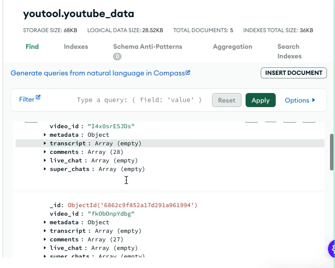

# 🎙️ YouTube Data Collector (Flask + YouTube API + MongoDB)

Este projeto é uma aplicação web em Flask que permite ao usuário inserir o **ID de um canal do YouTube** (ex: `UC_x5XG1OV2P6uZZ5FSM9Ttw`) ou um **@handle** (ex: `@nome_do_canal`) para coletar automaticamente:

- ✅ **Informações do canal**
- ✅ **Dados dos vídeos mais recentes**
- ✅ **Transcrição**
- ✅ **Comentários**
- ✅ **Mensagens de chat ao vivo (live chat)**
- ✅ **Super Chats**

Todos os dados são armazenados em um banco de dados **MongoDB** para posterior análise.

---

## 🚀 Funcionalidades

✅ Busca por ID ou @handle do canal  
✅ Coleta metadados dos vídeos mais recentes  
✅ Transcrição automática/manual (via `youtube-transcript-api`)  
✅ Comentários (via YouTube Data API)  
✅ Chat ao vivo e Super Chats de lives recentes  
✅ Interface web simples usando Flask  
✅ Armazenamento estruturado em MongoDB  

---

## 📦 Tecnologias Utilizadas

- Python 3.8+
- Flask
- MongoDB (local ou Atlas)
- YouTube Data API (via `google-api-python-client`)
- [youtube-transcript-api](https://pypi.org/project/youtube-transcript-api/)

---

## 🛠️ Instalação

1. Crie e ative um ambiente virtual:

```bash
python -m venv venv
source venv/bin/activate  # Linux/macOS
venv\Scripts\activate     # Windows
````

2. Instale as dependências:

```bash
pip install -r requirements.txt
```

3. Configure sua chave da API do YouTube:

Crie um arquivo chamado `conf.py` com o seguinte conteúdo:

```python
YOUTUBE_API_KEY = 'SUA_CHAVE_AQUI'
```

> Obtenha a chave em: [https://console.cloud.google.com/apis/credentials](https://console.cloud.google.com/marketplace/product/google/youtube.googleapis.com?q=search&referrer=search&inv=1&invt=Ab1m4g&project=youtool-464117)

4. Configure o MongoDB em `config.py`:

```python
MONGO_URI = 'mongodb://localhost:27017/'
DB_NAME = 'youtube_data'
```

---

## ▶️ Como Usar

1. Inicie a aplicação:

```bash
python app.py
```

2. Acesse no navegador:

[http://localhost:5000](http://localhost:5000)

3. Insira o **ID do canal** (por exemplo: `UC_x5XG1OV2P6uZZ5FSM9Ttw`) ou **@handle** (ex: `@canalxyz`)

4. A aplicação irá buscar as informações do canal, processar os vídeos mais recentes e exibir transcrições, comentários, chats e super chats.

5. Todos os dados são salvos no MongoDB automaticamente.

---

## 🧪 Exemplo de Documento no MongoDB

```json
{
  "channel_id": "UC_x5XG1OV2P6uZZ5FSM9Ttw",
  "channel_info": {
    "title": "Google Developers",
    "description": "The Google Developers channel",
    "subscriber_count": "2500000",
    "video_count": "1200",
    "view_count": "50000000"
  },
  "videos": [
    {
      "video_id": "dQw4w9WgXcQ",
      "metadata": {
        "title": "My Video",
        "description": "...",
        "published_at": "2023-10-10T00:00:00Z",
        "view_count": "10000",
        "like_count": "300",
        "live_chat_id": "XYZ..."
      },
      "transcript": [
        {
          "start": 0.0,
          "text": "Hello world"
        }
      ],
      "comments": [
        {
          "author": "Usuário",
          "text": "Ótimo vídeo!",
          "published_at": "2023-10-10T01:00:00Z"
        }
      ],
      "live_chat": [
        {
          "author": "LiveUser",
          "message": "Salve!",
          "timestamp": "2023-10-10T01:02:00Z",
          "type": "textMessageEvent"
        }
      ],
      "super_chats": [
        {
          "author": "Apoiador",
          "message": "Incrível!",
          "timestamp": "2023-10-10T01:05:00Z",
          "amount": "R$20,00"
        }
      ]
    }
  ]
}
```

---

## 📸 Demonstração

### 🧪 Vídeo mostrando a aplicação em funcionamento


---

### 📊 Visualização de dados armazenados



---

## 📄 requirements.txt

```txt
Flask
google-api-python-client
youtube-transcript-api
pymongo
```

---

## ❗ Observações

* A API do YouTube pode exigir quota adicional para grandes volumes de dados.
* O chat ao vivo e super chats só estão disponíveis para vídeos de transmissões ao vivo recentes.
* Transcrições só são retornadas para vídeos que possuem legendas habilitadas.

---

```
Desenvolvido por Kalil Alves e Enzo Pereira.
